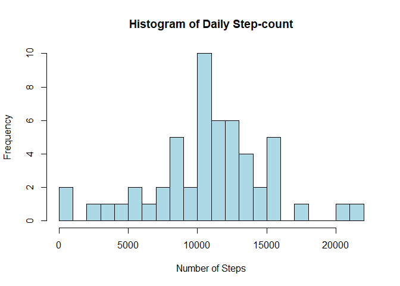
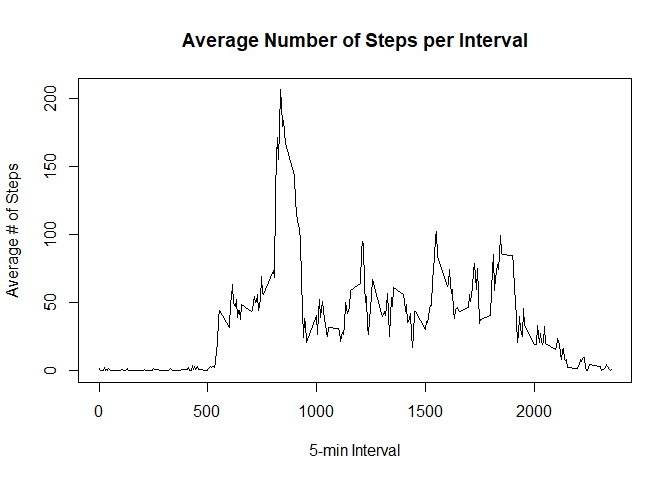
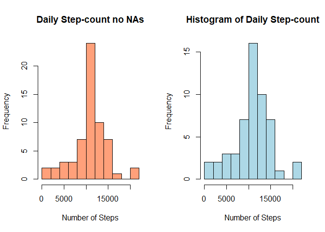

## Loading and preprocessing the data

```r
activity <- read.csv("activity.csv")
activity$date <- as.Date(activity$date)
```

## Histogram of total number of steps taken per day.

```r
steps_per_day <- aggregate(.~date, data = activity[, 1:2], sum)
hist(steps_per_day$steps, breaks = 20, col = "lightblue", xlab = "Number of Steps", main = "Histogram of Daily Step-count")
```

<!-- -->

## What are the mean and median total number of steps taken per day?

```r
mean(steps_per_day$steps)
```

```
## [1] 10766.19
```

```r
median(steps_per_day$steps)
```

```
## [1] 10765
```

## What is the average daily activity pattern?

```r
agg_int <- aggregate(.~interval, data = activity, mean)
plot(agg_int$interval, agg_int$steps, type = "l", xlab = "5-min Interval", 
     ylab = "Average # of Steps", main = "Average Number of Steps per Interval")
```

<!-- -->

## What interval, on average, has the maximum amount of steps?

```r
agg_int[which(agg_int$steps == max(agg_int$steps)), 1]
```

```
## [1] 835
```

## Imputing missing values

```r
colSums(is.na(activity))
```

```
##    steps     date interval 
##     2304        0        0
```

```r
new_activity <- activity
for (i in 1:length(new_activity$steps)) {
  if(is.na(new_activity$steps[i])) {
    int <- new_activity$interval[i]
    new_activity$steps[i] <- agg_int[agg_int$interval == int, 2]
  }
}
```

## Histogram of the total daily steps with imputed NA values

```r
par(mfrow = c(1, 2))
new_steps_per_day <- aggregate(.~date, data = new_activity[, 1:2], sum)
hist(new_steps_per_day$steps, breaks = 15, col = "lightsalmon1", xlab = "Number of Steps", main = "Daily Step-count no NAs")
hist(steps_per_day$steps, breaks = 15, col = "lightblue", xlab = "Number of Steps", main = "Histogram of Daily Step-count")
```

<!-- -->

```r
mean(new_steps_per_day$steps)
```

```
## [1] 10766.19
```

```r
median(new_steps_per_day$steps)
```

```
## [1] 10766.19
```


## Are there differences in activity patterns between weekdays and weekends?

```r
library(lattice)
weekdays <- c("Monday", "Tuesday", "Wednesday", "Thursday", "Friday")
new_activity$weekday <- factor((weekdays(new_activity$date) %in% weekdays), levels=c(FALSE, TRUE), labels=c('weekend', 'weekday'))
new_agg_wkday<- aggregate(.~interval + weekday, data = new_activity, mean)
with(new_agg_wkday, xyplot(steps ~ interval | weekday, data = new_agg_wkday, 
                          type = "l", layout = c(1, 2)))
```

<!-- -->


